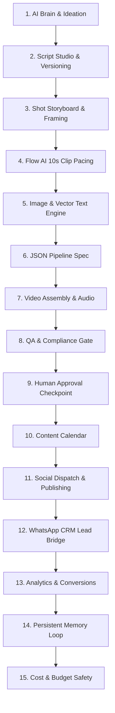

# 🤖 JARVIS — AI Social Media Content & Marketing Operating System
### Shree Radhe Krishna Digital Service (શ્રી રાધે કૃષ્ણ ડિજિટલ સેવા)
**Location:** Rudra Complex, Timberwa Road, Sadhli, Taluka: Shinor, District: Vadodara, Gujarat 391250  
**Public Inquiries:** [khushidigitalseva11@gmail.com](mailto:khushidigitalseva11@gmail.com) *(Strict Email-Only Public Policy)*  

---

[](https://whatsapp-crm-khushidigitalseva11-hub.vercel.app)
[](https://supabase.com)
[](https://nextjs.org)
[](https://react.dev)
[](https://www.typescriptlang.org)
[](./vitest.config.ts)

---

## 📌 Overview

**JARVIS** is an end-to-end AI-powered Social Media Marketing & Operations Operating System designed for **Shree Radhe Krishna Digital Service**. It unifies:

1. **Autonomous Marketing Engine:** Generates high-retention bilingual Gujarati & English video concepts, hooks, and 10-second shot storyboards.
2. **Citizen Digital Services Portal:** Complete facilitation for 21 government and online citizen services with transparent locked pricing.
3. **Private WhatsApp CRM:** Multi-agent shared inbox, automations, broadcasts, and AI lead assistance powered by the official Meta WhatsApp Cloud API.
4. **Integrations Manager:** Zero-trust credentials manager for Supabase, Meta, OpenAI, Gemini, Flow AI, and Razorpay.

---

## 🚀 The 15-Module JARVIS Studio Lifecycle



### Module Highlights

| Module | Core Functionality |
| :--- | :--- |
| **1. AI Brain & Ideation** | Generates tailored marketing angles for farmers, youth, seniors, and MSMEs across 21 citizen services. |
| **2. Script Studio** | Dual-version (V1 & V2) bilingual Gujarati + English scripts with 3-second retention hooks and clear CTAs. |
| **3. Shot Storyboard** | 9:16 vertical mobile framing, camera angles, lighting notes, and Gujarati on-screen text badges. |
| **4. Flow AI 10s Pacing** | Strictly splits videos into 10-second clips with consistent character, voice, and lighting continuity. |
| **5. Image & Overlay** | Vector Gujarati typography overlay without baked-in image text distortion. |
| **6. JSON Spec** | Machine-readable prompt specifications for headless video renderers. |
| **7. Video Assembly** | Multi-track timeline preview with background music (BGM), audio ducking, and subtitle toggles. |
| **8. QA & Compliance** | 6-point compliance checklist: price accuracy, document checklist, phone-free public CTA, and duration rules. |
| **9. Human Approval** | 3-state governance workflow (`Draft` $\to$ `Pending Review` $\to$ `Approved`). |
| **10. Content Calendar** | Multi-platform scheduling for Instagram Reels, YouTube Shorts, and WhatsApp Status. |
| **11. Social Dispatch** | Auto-publishing via Meta Graph API or one-click **"Copy Post Package"** manual fallback. |
| **12. CRM Lead Bridge** | Inbound WhatsApp query analysis, instant service detection, locked fee lookup, and suggested responses. |
| **13. Analytics & Conversions**| Tracks campaign views against actual digital seva applications and revenue generated. |
| **14. Persistent Memory** | AI feedback loop tracking top-performing hooks, optimal durations, and brand preferences. |
| **15. Cost & Budget** | Per-project budget caps and estimated API usage monitoring to prevent runaway costs. |

---

## 🏛️ Citizen Digital Services Catalog (21 Services)

All services operate with **transparent, locked pricing** and standard required document checklists:

| # | Service Name (English) | સેવા નામ (ગુજરાતી) | Locked Price | Typical Delivery |
| :---: | :--- | :--- | :---: | :---: |
| 1 | **PAN Card** | નવું પાન કાર્ડ / સુધારો | **₹250** | 3–5 Days |
| 2 | **Aadhaar Services** | આધાર કાર્ડ પ્રિન્ટ / સહાય | **₹50** | Instant |
| 3 | **Ayushman Bharat Card** | આયુષ્માન ભારત કાર્ડ | **₹50** | Same Day |
| 4 | **E-Shram Card** | ઇ-શ્રમ કાર્ડ રજીસ્ટ્રેશન | **₹60** | Same Day |
| 5 | **Election Voter ID** | ચૂંટણી કાર્ડ / સુધારો | **₹80** | 7–10 Days |
| 6 | **Ration Card** | રેશન કાર્ડ સેવાઓ | **₹150** | 7–15 Days |
| 7 | **Income Certificate** | આવકનો દાખલો | **₹150** | 3–5 Days |
| 8 | **Caste Certificate** | જાતિનો દાખલો | **₹150** | 5–7 Days |
| 9 | **Domicile Certificate** | ડોમિસાઇલ સર્ટિફિકેટ | **₹200** | 5–7 Days |
| 10 | **Driving Licence Assistance** | ડ્રાઇવિંગ લાયસન્સ સહાય | **₹350** | Slot based |
| 11 | **Passport Assistance** | પાસપોર્ટ ઓનલાઇન ફોર્મ | **₹500** | Appointment |
| 12 | **Electricity Bill Payment** | લાઈટ બિલ પેમેન્ટ & પ્રિન્ટ | **₹20** | Instant |
| 13 | **7/12 & 8A Land Records** | ૭/૧૨ અને ૮-અ જમીન ઉતારા | **₹50** | Instant |
| 14 | **Digital Gujarat Scholarships** | ડિજિટલ ગુજરાત સ્કોલરશિપ | **₹150** | Season based |
| 15 | **Police Verification Form** | પોલીસ વેરિફિકેશન ફોર્મ | **₹100** | 1–2 Days |
| 16 | **PF / EPFO Withdrawal** | પીએફ ઉપાડ ઓનલાઇન ક્લેમ | **₹300** | 7–14 Days |
| 17 | **Job Application Forms** | સરકારી ભરતી ઓનલાઇન ફોર્મ | **₹100** | Same Day |
| 18 | **Fastag Recharge & Issuance** | ફાસ્ટેગ રિચાર્જ / નવું કાર્ડ | **₹100** | Instant |
| 19 | **PVC Smart Card Printing** | પીવીસી પ્લાસ્ટિક સ્માર્ટ કાર્ડ | **₹70** | Instant Print |
| 20 | **Gumasta Dhara / Shop Act** | ગુમાસ્તા ધારા નોંધણી | **₹300** | 2–3 Days |
| 21 | **Udyam MSME Registration** | ઉદ્યમ આધાર / એમએસએમઇ | **₹250** | 1–2 Days |

---

## 🔒 Strict Public Contact & Privacy Policy

- **Public Marketing & Citizen Portal:**
  - **Email Only:** `khushidigitalseva11@gmail.com`
  - Public pages strictly contain **0 phone numbers, 0 `wa.me` links, and 0 `tel:` tags**.
- **Private Internal WhatsApp CRM:**
  - Official WhatsApp Business communication runs strictly through the authenticated Meta Cloud API from authorized server endpoints.

---

## 🛠️ Tech Stack & Architecture

- **Frontend:** Next.js 16 (App Router, Turbopack), React 19, Tailwind CSS v4, Lucide Icons.
- **Backend:** Next.js Server Components, Route Handlers, Edge & Node runtimes.
- **Database:** Supabase PostgreSQL Cloud, pgvector embeddings, 42 safe migrations, Row Level Security (RLS).
- **CRM Integration:** Official Meta WhatsApp Cloud API (v20.0+), HMAC webhook verification, AES-256-GCM encrypted tokens.
- **Testing:** Vitest test suite (91 test files, 1,075 passing tests), Next.js typecheck (`tsc --noEmit`).

---

## ⚙️ Environment Configuration

Copy `.env.example` to `.env.local` and configure your credentials:

```bash
# Core Supabase Cloud
NEXT_PUBLIC_SUPABASE_URL=https://your-project.supabase.co
NEXT_PUBLIC_SUPABASE_ANON_KEY=your-supabase-anon-key
SUPABASE_SERVICE_ROLE_KEY=your-supabase-service-role-key

# App & Domain
NEXT_PUBLIC_SITE_URL=https://your-domain.vercel.app
NEXT_PUBLIC_APP_LOCALE=en

# Meta / WhatsApp Business API
META_APP_ID=your-meta-app-id
META_APP_SECRET=your-meta-app-secret
ENCRYPTION_KEY=your-32-byte-hex-encryption-key

# Optional Expansion APIs (Autonomous Fallback active if left blank)
OPENAI_API_KEY=
GEMINI_API_KEY=
FLOW_AI_API_KEY=
INSTAGRAM_ACCOUNT_ID=
META_USER_ACCESS_TOKEN=
YOUTUBE_CLIENT_ID=
YOUTUBE_CLIENT_SECRET=
YOUTUBE_REFRESH_TOKEN=
RAZORPAY_KEY_ID=
RAZORPAY_KEY_SECRET=
```

---

## 🧪 Testing & Validation

```bash
# Typecheck
npm run typecheck

# Automated Test Suite (1,075 tests)
npm run test

# Production Build Test
npm run build

# Live JARVIS Engine Integration Test
node scripts/test_jarvis_live.js
```

---

## 📄 License & Ownership

© 2026 **Shree Radhe Krishna Digital Service** (Sadhli, Vadodara, Gujarat).  
Licensed under the [MIT License](./LICENSE).
